# Lake Mind Architecture, Design, and Interview Guide

## 1. Purpose and audience

This document explains Lake Mind from system context down to implementation details.
It is written for a data engineer who understands pipelines, dimensional modeling,
Spark, and SQL, but is still learning GenAI, embeddings, vector search, RAG, and LLM
application design.

Use it to:

- understand what every architecture block does;
- trace data and requests end to end;
- separate deterministic data engineering from probabilistic LLM behavior;
- explain the design and its tradeoffs in an interview;
- identify risks, missing controls, and production improvements;
- ask better questions before extending the platform.

Two labels are used throughout:

- **Implemented now** means the behavior exists in this repository.
- **Production target** means a recommended evolution, not current behavior.

Lake Mind is currently a strong local/portfolio architecture. It demonstrates real
data-platform and GenAI integration patterns, but it is not yet a secure, scalable,
multi-user production service.

---

## 2. Thirty-second architecture summary

Lake Mind ingests Olist e-commerce CSV files with local PySpark and stores them as
Bronze, Silver, and Gold Parquet datasets. DuckDB discovers those folders and exposes
them as SQL views without requiring a database server. A semantic layer maps business
language to governed metrics, dimensions, approved SQL routes, and constrained dynamic
SQL. Synthetic Markdown documents are chunked, embedded with a sentence-transformer,
and persisted in ChromaDB.

For natural-language questions, an Ollama model classifies the request as chat,
structured, document, or hybrid. Structured questions execute governed SQL through
DuckDB; document questions retrieve semantically similar chunks from ChromaDB; hybrid
questions do both. A second Ollama call converts the already-grounded results into a
human-readable answer. FastAPI exposes the capabilities, Streamlit provides query and
chat interfaces, and optional Airflow DAGs orchestrate the medallion pipeline.

The most important design rule is:

> The LLM may route and explain, but governed code, approved SQL, structured results,
> retrieved documents, and metric definitions remain the sources of truth.

---

## 3. System context: who uses the platform and what surrounds it

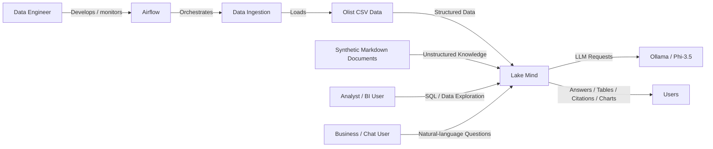
 
### External actors and systems

**Data engineer**

- Places source files in the expected directories.
- Runs or schedules Bronze, Silver, and Gold jobs.
- validates counts, schemas, data quality, and metric correctness.
- Maintains configuration, semantic mappings, and pipeline code.

**Analyst or BI user**

- Uses the query UI or `/query` endpoint.
- Queries DuckDB views over Parquet.
- Consumes curated Gold tables rather than rebuilding metrics from raw data.

**Business or chat user**

- Uses the chatbot UI or `/answer`.
- Does not need to know table names or SQL.
- Receives an answer plus supporting rows, SQL, source names, and chart metadata.

**Olist CSV dataset**

- Provides the structured transaction, customer, product, seller, payment, review,
  order-item, category, and geolocation data.
- Contains approximately 100,000 orders and is batch-oriented, not streaming.

**Synthetic Markdown documents**

- Provide fictional policy, FAQ, onboarding, logistics, privacy, and business-unit
  context for demonstrating RAG.
- Are not official Olist documents and must be presented as synthetic demo content.

**Ollama**

- Hosts the local `phi3.5` model.
- Performs intent routing and answer wording.
- Does not have direct database access and is not trusted to invent SQL or metrics.

**Airflow**

- Optionally schedules and validates batch jobs.
- Runs in Docker with PostgreSQL metadata storage and `LocalExecutor`.

---

## 4. High-level block architecture

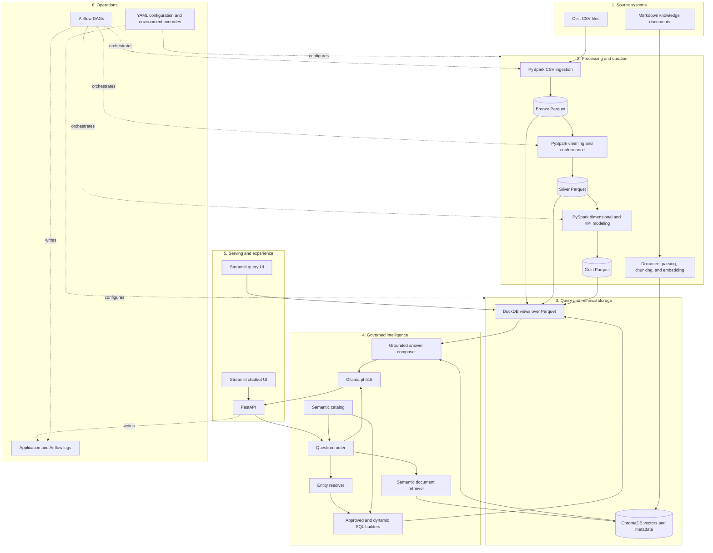

### Block 1: source systems

The structured path begins with nine CSV files under `Master/olist Dataset`. The
unstructured path begins with six synthetic Markdown documents under
`Master/Olist documents`. Keeping these paths outside the project source directory
separates input data from code and generated data, although a production platform
would use object storage and registered datasets rather than local folders.

### Block 2: processing and curation

PySpark handles batch ingestion and medallion transformations. Bronze preserves
source-like values with technical metadata. Silver applies types, standardization,
deduplication/enrichment logic, and creates an item-grain analytical table. Gold
creates dimensional and aggregate models suitable for governed analytics.

The document path is separate: Markdown text is parsed into sections, enriched with
metadata, converted into numerical embedding vectors, and written to ChromaDB.

### Block 3: query and retrieval storage

DuckDB is a SQL execution engine, not the system of record. It discovers Parquet
folders and creates views such as `bronze.orders`, `silver.order_details`, and
`gold.executive_summary`. ChromaDB stores embedding vectors, chunk text, and metadata
for similarity search.

### Block 4: governed intelligence

This block is the bridge between traditional data engineering and GenAI. It combines:

- deterministic entity extraction;
- governed business vocabulary;
- approved SQL routes;
- constrained dynamic SQL generation;
- optional LLM intent classification;
- vector retrieval;
- grounded natural-language answer generation.

The architecture deliberately avoids unrestricted text-to-SQL.

### Block 5: serving and experience

FastAPI exposes ingestion, SQL, retrieval, routing, and answer endpoints. The query
Streamlit UI talks directly to DuckDB. The chatbot Streamlit UI calls FastAPI and
displays the answer together with evidence.

### Block 6: operations

YAML and environment variables configure local components. Airflow optionally
orchestrates Bronze, Silver, and Gold jobs. Logging exists, but production metrics,
tracing, dependency health, alerting, and lineage are not yet implemented.

---

## 5. Data engineering design

### 5.1 Medallion flow

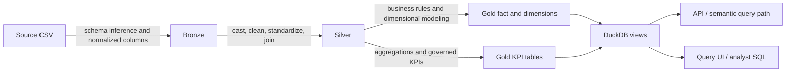

### 5.2 Bronze layer

**Implemented now**

- Code: `src/ingestion/csv_ingestion.py`
- Output: `data/bronze/<table>/*.parquet`
- Orchestration: `dags/bronze_ingestion_dag.py`
- Grain: source-dependent and close to one row per source record.

Bronze responsibilities:

- read one or more CSV files with Spark in `PERMISSIVE` mode, including multiline
  quoted records;
- derive a canonical table name from each filename;
- normalize column names;
- preserve source values as string-like fields until Silver rather than inferring
  schema in Bronze;
- add `source_file`, `source_file_path`, and `ingested_at` metadata;
- write a replayable Parquet dataset.

Bronze intentionally does not calculate KPIs, join business entities, or apply
reporting logic. This makes it possible to rebuild downstream layers when rules
change without downloading the source again.

**Interview point:** minimal transformation does not mean zero validation. A robust
Bronze layer still records source filename, ingestion time, batch ID, row counts,
schema, corrupt-record counts, and checksums.

### 5.3 Silver layer

**Implemented now**

- Code: `src/transformations/silver_transformations.py`
- Output: `data/silver/<table>/*.parquet`
- Orchestration: `dags/silver_transformation_dag.py`
- Tables: category translation, geolocation, customers, sellers, orders,
  order items, order payments, order reviews, products, and `order_details`.

Silver responsibilities:

- cast raw strings into useful date and numeric types;
- clean and standardize source values;
- correct known source inconsistencies;
- prepare reusable conformed entities;
- join relevant order, item, customer, product, payment, review, and seller context;
- create `silver.order_details` at one row per order item.

The critical grain warning is that `payment_value` originates at order/payment grain
and can repeat when joined to item rows. Summing the repeated order value at item grain
overstates revenue. The Gold model therefore uses allocated payment value for
item-level product, category, and seller analysis.

**Interview point:** always state the grain before discussing a fact table or metric.
Many analytical errors are grain errors rather than SQL syntax errors.

### 5.4 Gold layer

**Implemented now**

- Code: `src/transformations/gold_transformations.py`
- Output: `data/gold/<table>/*.parquet`
- Orchestration: `dags/gold_transformation_dag.py`

The star-schema-style model contains:

- `gold.fact_order_item`: item-level analytical events and measures;
- `gold.dim_date`: calendar attributes and date keys;
- `gold.dim_customer`: customer attributes;
- `gold.dim_product`: translated product/category attributes;
- `gold.dim_seller`: seller attributes;
- `gold.dim_payment_type`: payment classifications;
- `gold.dim_order_status`: order-state classifications.

The aggregate and semantic-ready model contains:

- `gold.executive_summary`;
- `gold.sales_daily`;
- `gold.category_performance`;
- `gold.category_monthly_trends`;
- `gold.payment_performance`;
- `gold.customer_retention`;
- `gold.geo_sales`;
- `gold.seller_performance`;
- `gold.review_performance`;
- `gold.kpi_by_dimension`;
- `gold.data_availability`.

`gold.data_availability` exposes the minimum date, maximum date, number of available
days, and total orders through a dedicated API endpoint. The chatbot does not yet
inject this range into its answer prompt, so preventing unsupported-period answers is
a recommended improvement rather than a complete current guardrail.

### 5.5 Gold star design

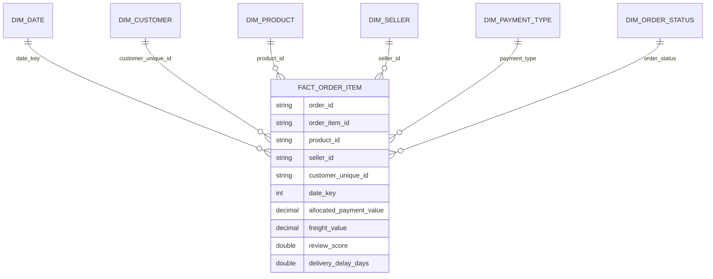

The diagram is conceptual: inspect the transformation code and generated Parquet
schema for exact physical types and nullable fields.

### 5.6 Metric contracts

**Total revenue**

- Order-level definition: sum payment value once at its valid grain.
- Item-level definition: sum allocated payment value to avoid multiplying an order's
  payment across its items.

**Average order value**

- `total_revenue / distinct total_orders`.

**Cancellation rate**

- canceled distinct orders divided by all distinct orders.
- Confirm whether the consumer expects a ratio or percentage; code paths may format it
  differently.

**Repeat customer**

- a `customer_unique_id` with more than one distinct order.

**Delivery delay**

- actual customer delivery date minus estimated delivery date.
- Negative means early delivery, positive means late delivery.

**Unsupported with current data**

- true profit or margin;
- marketing ROI;
- customer acquisition cost;
- defensible lifetime value.

These require cost, marketing-spend, and acquisition data that the Olist dataset does
not provide. A good system should say "unsupported" rather than manufacture a proxy.

### 5.7 Ingestion sequence

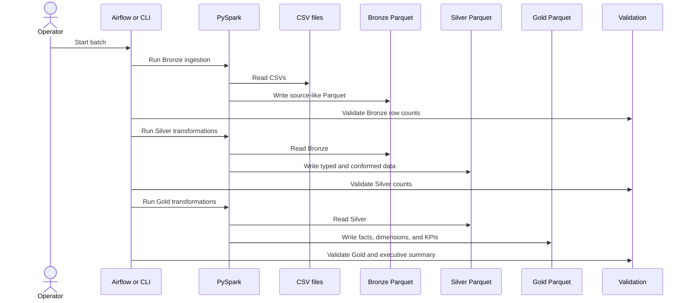

### 5.8 Current batch characteristics

- Processing is full-refresh/overwrite rather than incremental.
- Spark runs locally for direct development.
- Airflow uses sequential tasks and `LocalExecutor`.
- Each Airflow DAG is manually triggered; there is no parent DAG that chains
  Bronze, Silver, and Gold end to end.
- Parquet is the durable analytical store.
- There is no ACID table format, transaction log, schema registry, or time travel.
- Data-quality checks are mostly row-count and sanity checks.
- Late-arriving records, CDC, idempotent merge keys, and partition evolution are not
  yet designed.

---

## 6. DuckDB query design

**Implemented now**

- Code: `src/query/duckdb_service.py`
- Engine: embedded DuckDB.
- Default API connection: in-memory and created per request.

On service initialization, DuckDB:

1. scans `data/bronze`, `data/silver`, and `data/gold`;
2. finds child directories containing Parquet files;
3. sanitizes folder names into SQL identifiers;
4. creates schemas for each medallion layer;
5. registers each folder as a view using `read_parquet('.../*.parquet')`.

This is a schema-on-read design. Parquet remains the storage format; DuckDB supplies
SQL parsing, optimization, vectorized execution, and Pandas conversion.

The `/query` path accepts only queries starting with `SELECT`, `WITH`, `DESCRIBE`,
`SHOW`, or `EXPLAIN`, rejects a blocklist of mutation keywords, and applies a limit
when one is absent.

### Why DuckDB fits this project

- no database server to install or administer;
- efficient columnar scans and predicate pushdown over Parquet;
- low operational overhead for a single-machine analytical workload;
- standard SQL and easy Python integration.

### When it stops fitting

- many concurrent users;
- centralized access control and row-level security;
- high write concurrency;
- very large distributed datasets;
- workload isolation and autoscaling requirements;
- strict high availability or disaster recovery requirements.

At that point, evaluate a warehouse/lakehouse engine such as Databricks SQL, Spark
Thrift/Connect, Trino, Snowflake, BigQuery, or Redshift based on constraints.

---

## 7. GenAI concepts mapped to this project

### 7.1 LLM

A large language model predicts likely token sequences. In this project, Ollama hosts
`phi3.5` locally. The model is useful for understanding phrasing, classifying intent,
and writing an answer, but it is not inherently aware of current Parquet data,
business definitions, or document truth.

### 7.2 Embedding

An embedding converts text into a dense numerical vector. Texts with related meaning
should be near one another in vector space even when they do not share exact words.
Lake Mind uses `all-MiniLM-L6-v2` through `sentence-transformers`.

Example: "How long can I return electronics?" may be close to a chunk containing
"electronics return window" even if the wording differs.

### 7.3 Vector database

ChromaDB stores:

- each chunk's embedding vector;
- the original text;
- a stable chunk ID;
- metadata such as source document, section title, category, and region.

At query time, ChromaDB compares the question embedding with stored vectors and returns
the nearest chunks plus distances.

### 7.4 Retrieval-augmented generation

RAG has two different phases:

**Offline/indexing phase**

1. read documents;
2. split them into meaningful chunks;
3. attach metadata;
4. create embeddings;
5. persist vectors and content.

**Online/query phase**

1. embed the user's question;
2. find similar chunks;
3. place those chunks into the LLM prompt;
4. ask the LLM to answer only from supplied evidence;
5. return citations/evidence with the answer.

RAG does not retrain the LLM. It supplies external context at request time.

### 7.5 Semantic layer

The semantic layer is a governed contract between business language and physical data.
In Lake Mind it consists mainly of:

- `config/business_entities.yaml`: aliases for metrics, dimensions, locations,
  categories, payment types, statuses, countries, and time terms;
- `config/semantic_catalog.yaml`: approved routes, document keywords, Gold tables,
  and vetted SQL;
- `src/semantic/entity_resolver.py`: extracts canonical entities from user text;
- `src/semantic/dynamic_sql_builder.py`: composes SQL from allowlisted expressions;
- `src/semantic/sql_builder.py`: selects approved catalog routes;
- `src/semantic/metric_catalog.py`: loads catalog metadata.

This layer solves a different problem from RAG. RAG retrieves narrative text.
The semantic layer protects metric meaning and SQL behavior.

### 7.6 Deterministic versus probabilistic boundary

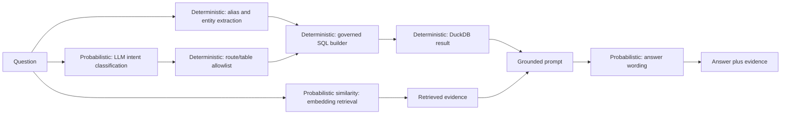

Important nuance: vector similarity is mathematically deterministic for fixed models,
data, and settings, but relevance is semantic and approximate rather than a guaranteed
business rule. LLM output is probabilistic and can vary.

---

## 8. Document ingestion and RAG design

**Implemented now**

- Code: `src/ingestion/document_ingestion.py`
- Source: `Master/Olist documents`
- Persistent store: `data/chromadb`
- Default collection: `olist_demo_documents`
- Embedding model: `all-MiniLM-L6-v2`.

The ingestion module:

1. reads Markdown;
2. splits general documents by level-two headings;
3. handles business-unit documents with separator-aware parsing;
4. preserves FAQ question-and-answer pairs as individual chunks;
5. derives metadata such as document category, section title, FAQ section, and a
   synthetic-document flag;
6. extracts known category or state references when present;
7. generates a stable SHA-256 chunk ID from source, section, and content;
8. creates normalized 384-dimensional embeddings;
9. upserts records into ChromaDB.

Stable IDs make repeated ingestion closer to idempotent because unchanged chunks map
to the same identifier.

The configured fixed `chunk_size` and `chunk_overlap` are not currently applied;
chunking follows Markdown structure. Retrieval also reloads the embedding model for
each call and does not yet use the stored metadata as query filters. These are
important latency and relevance improvements.

### RAG ingestion flow

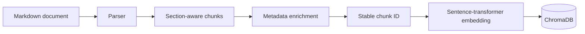

### RAG query flow

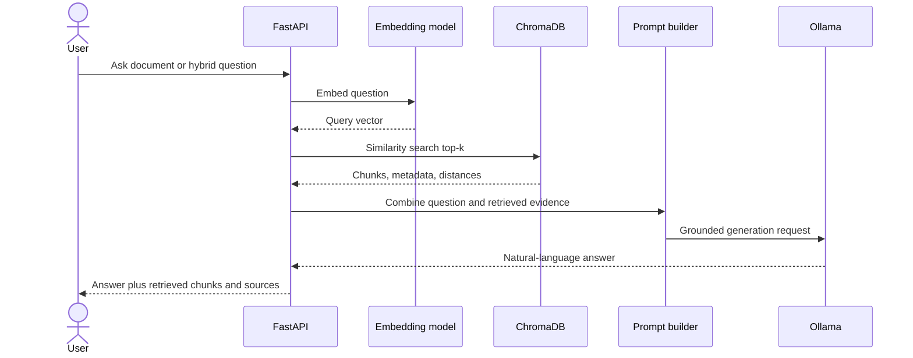

### Chunking tradeoffs

Chunks that are too small lose context. Chunks that are too large reduce retrieval
precision and consume more model context. Section-aware chunking is sensible for
policy documents because headings carry meaning, but production evaluation should
measure whether long sections need token-based sub-chunking with overlap.

### Retrieval quality controls to add

- relevance threshold instead of always trusting top-k;
- hybrid lexical plus vector retrieval;
- metadata filters for document type, category, region, and validity dates;
- reranking with a cross-encoder;
- explicit "insufficient evidence" behavior;
- versioning and effective dates for policy documents;
- offline evaluation sets with expected sources;
- recall@k, precision@k, mean reciprocal rank, groundedness, and citation correctness.

---

## 9. Natural-language routing and governed SQL

### 9.1 Supported question classes

**Chat**

- Greetings or ordinary conversation.
- No DuckDB or ChromaDB call is required.

**Structured**

- Metrics, rankings, trends, dimensions, or filters.
- Uses governed SQL and DuckDB.

**Document**

- Policy, FAQ, onboarding, privacy, or narrative context.
- Uses ChromaDB retrieval.

**Hybrid**

- Requires both measured data and narrative guidance.
- Example: "Which states have high delivery delay, and what SLA applies?"

### 9.2 Routing logic

`src/qa/question_router.py` first asks Ollama for a constrained JSON classification.
If Ollama fails, deterministic keyword/entity fallback logic remains available.

The LLM may return a route name, but `src/llm/routing_service.py` verifies that it
exists in the loaded catalog. Unknown route names and tables are discarded. This
prevents the model from selecting arbitrary database objects.

Entity extraction identifies known metrics, dimensions, locations, categories,
payment types, statuses, countries, years, and limits. The dynamic SQL builder then
uses only predefined expressions, joins, tables, and filters. If dynamic construction
does not apply, the system selects approved SQL from the semantic catalog.

### 9.3 Why this is safer than unrestricted text-to-SQL

Unrestricted text-to-SQL lets an LLM invent:

- tables and columns;
- joins with incorrect cardinality;
- metric formulas;
- unsafe statements;
- unsupported filters;
- computationally expensive queries.

Lake Mind constrains these choices in code and YAML. The cost is lower flexibility:
new metrics and dimensions require explicit semantic-layer changes.

### 9.4 Question-to-answer sequence

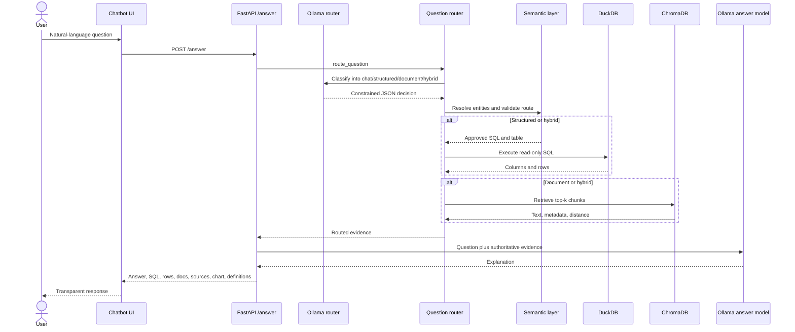

### 9.5 Grounding hierarchy

When evidence conflicts, reason in this order:

1. governed metric definitions and explicit business rules;
2. DuckDB result produced by approved SQL;
3. retrieved document text and metadata;
4. LLM-generated prose.

The prose is the presentation layer, not the evidence layer.

---

## 10. API and user-interface design

### 10.1 FastAPI

**Implemented now**

- Code: `src/api/main.py`
- Entry point: `run_api.py`
- Development address: `http://localhost:8000`

Endpoints:

- `GET /health`: basic liveness and application version.
- `POST /ingest`: ingest one CSV through Spark.
- `POST /ingest/batch`: ingest multiple CSV files.
- `GET /tables`: list discovered DuckDB views by medallion layer.
- `POST /query`: execute caller-supplied read-only SQL.
- `GET /data-availability`: return Gold date-range metadata.
- `POST /retrieve-docs`: retrieve ChromaDB chunks.
- `POST /ask`: route and gather structured/document evidence without final prose.
- `POST /answer`: run `/ask`, call Ollama, and return a complete response.

The `/answer` response includes:

- question and type;
- generated answer;
- recommended table;
- structured SQL;
- columns, rows, and row count;
- retrieved documents;
- chart recommendation;
- source table/document names;
- metric definitions;
- routing notes.

This evidence-rich response is a good explainability pattern: consumers can inspect
what supports the prose instead of trusting a black-box answer.

### 10.2 Query UI

**Implemented now**

- Code: `tools/query_ui.py`
- Connects directly to DuckDB rather than FastAPI.
- Browses tables and date availability.
- Runs SQL and exports results to CSV.
- Maintains a long-lived query service at module scope.

This is convenient for local development but creates two access paths with different
controls. A production UI should normally use one governed API boundary.

### 10.3 Chatbot UI

**Implemented now**

- Code: `tools/chatbot_ui.py`
- Calls FastAPI `/answer`.
- Discovers Ollama models.
- Displays answer, structured rows, SQL, retrieved documents, chart suggestions,
  sources, and metric definitions.

### 10.4 Current runtime behavior

- FastAPI handlers are synchronous.
- The development server runs one reload-enabled Uvicorn process.
- Spark, embedding, DuckDB, and Ollama calls can block request handling.
- API DuckDB connections are opened and closed per request.
- The sentence-transformer can be loaded during retrieval calls, adding cold latency.
- Ollama routing and answer generation are sequential calls.

This is acceptable for a local demo, not for high-concurrency service.

---

## 11. Configuration and operations design

### Configuration files

- `config/config.yaml`: Spark, paths, DuckDB, ChromaDB, embedding, LLM, and logging.
- `config/semantic_catalog.yaml`: approved routes and document signals.
- `config/business_entities.yaml`: canonical business vocabulary and aliases.
- `src/utils/config_loader.py`: YAML loader with selected environment overrides.

Environment overrides include Spark master/memory, DuckDB path, ChromaDB path, and
legacy LLM settings. Ollama also uses `OLLAMA_URL`, `OLLAMA_MODEL`, and
`OLLAMA_ROUTER_MODEL`.

### Known configuration drift

- `config.yaml` names a Hugging Face Phi model, while runtime generation uses Ollama
  `phi3.5`.
- Config and document-ingestion defaults use different Chroma collection names.
- API DuckDB currently uses an in-memory connection rather than the configured path.
- Spark session memory is hardcoded below the YAML values.
- `python-dotenv` is installed, but application code does not load a `.env` file.

These should be consolidated into a typed settings contract and validated at startup.

### Airflow

The optional Docker stack runs:

- PostgreSQL for Airflow metadata;
- initialization;
- Airflow webserver;
- Airflow scheduler;
- `LocalExecutor`.

The three DAGs run Bronze, Silver, and Gold workflows with basic count/sanity
validation. The container mounts project code, logs, DAGs, source CSVs, and data
folders. Local Windows paths and Linux container paths differ, which is an operational
portability concern.

---

## 12. Current deployment architecture

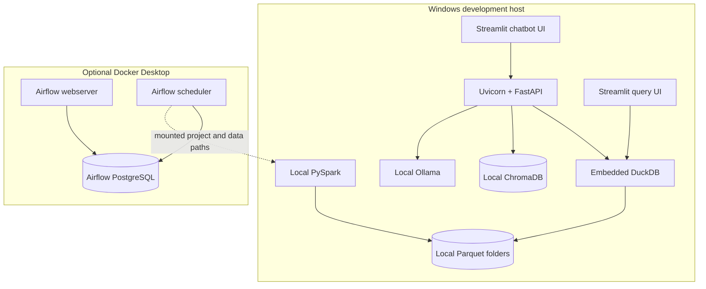

Strengths:

- easy to understand and debug;
- low infrastructure cost;
- local privacy for data and model calls;
- suitable for learning and demonstrations.

Constraints:

- single-machine failure domain;
- no independent scaling;
- no authentication or tenant isolation;
- local filesystem coupling;
- limited concurrency;
- environment differences between Windows and Docker.

---

## 13. Non-functional architecture assessment

### Security

Current state:

- no API authentication or authorization;
- `/ingest` accepts arbitrary file paths;
- `/query` accepts caller-supplied SQL with regex/blocklist safeguards;
- no rate limiting;
- default Airflow credentials are for local use;
- no secrets manager;
- no row-level or column-level access controls.

Priority improvements:

1. place APIs behind authentication;
2. define roles for ingestion, querying, and administration;
3. restrict ingestion to an allowlisted landing directory;
4. remove or strongly isolate raw SQL access;
5. use database/parser-level read-only enforcement, not only regex;
6. apply request size, timeout, concurrency, and rate limits;
7. use secrets management and non-default Airflow credentials;
8. add dependency and container scanning.

### Reliability

Current state:

- batch overwrite makes reruns simple but can replace good output after partial errors;
- no transaction across multiple Parquet table writes;
- no durable job state outside Airflow;
- local components are single points of failure;
- LLM fallback exists for routing, but answer generation still depends on Ollama.

Priority improvements:

- write to staging paths and atomically promote validated output;
- add batch manifests, checksums, and run IDs;
- define retries only for transient failures;
- add dead-letter/quarantine paths for bad records;
- implement dependency-aware health checks;
- version semantic catalogs and document indexes;
- define backup and restore for Parquet, vector data, and metadata.

### Scalability and performance

Current bottlenecks:

- synchronous API endpoints;
- embedding-model load/cold start;
- per-request DuckDB discovery and registration;
- two sequential Ollama calls for many questions;
- local Spark and local files;
- large result conversion through Pandas and JSON;
- no caching.

Priority improvements:

- load embedding model once per process;
- create managed DuckDB connection/session lifecycle;
- move long Spark ingestion out of request handlers into jobs/queues;
- cache safe routing, embeddings, and common query results;
- stream or paginate large result sets;
- add worker limits around Ollama;
- separate API, retrieval, and batch workloads before scaling independently.

### Observability

Current state:

- standard text logging;
- Airflow task logs;
- basic `/health`;
- no metrics, traces, request IDs, or persisted routing audit.

Add:

- structured logs with request ID, route, source tables, document IDs, latency, and
  outcome;
- metrics for API latency/error rate, DuckDB scan time, retrieval latency, Ollama
  latency, token counts, top-k distances, pipeline row counts, and data freshness;
- distributed traces across API, retrieval, DuckDB, and Ollama;
- dependency readiness checks;
- dashboards and actionable alerts;
- privacy-aware prompt/response logging policies.

### Data quality and governance

Add checks for:

- source freshness and completeness;
- schema drift;
- primary-key uniqueness;
- foreign-key coverage;
- accepted status/category values;
- null thresholds;
- order/payment/item reconciliation;
- allocated revenue reconciliation back to order revenue;
- metric regression;
- dataset and semantic-catalog lineage;
- owners, SLAs, and data contracts.

---

## 14. Recommended production target architecture

This is an evolution path, not a claim about the current repository.

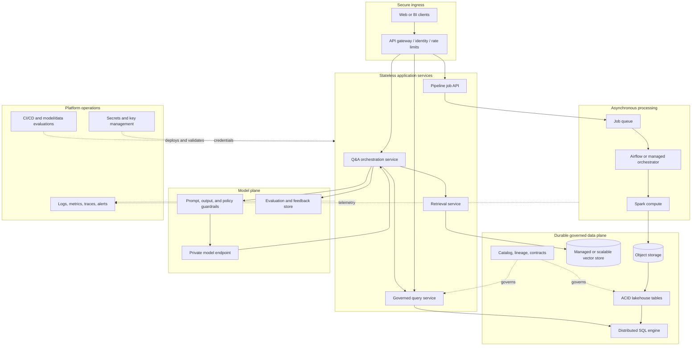

### Migration sequence

1. Keep the current architecture but add tests, typed settings, structured logs,
   security boundaries, and resource reuse.
2. Remove Spark execution from synchronous API requests.
3. Add job manifests, data contracts, and stronger quality checks.
4. Move local files to object storage and adopt an ACID lakehouse format if
   incremental writes require it.
5. Centralize query access behind a governed service.
6. Separate retrieval and model serving when load justifies it.
7. Add continuous RAG and answer evaluation before increasing user scope.

Do not distribute the system merely to look enterprise-grade. Introduce each service
only when scale, ownership, reliability, or security requires the boundary.

---

## 15. Major architecture decisions and tradeoffs

### Parquet plus DuckDB instead of PostgreSQL

**Why:** analytical, columnar, zero-server, local-friendly, and easy to replay.

**Tradeoff:** weaker concurrency, security administration, transactional behavior, and
central governance than a managed database or warehouse.

### PySpark for a laptop-sized dataset

**Why:** demonstrates scalable transformation APIs and a path to larger execution.

**Tradeoff:** greater setup and runtime overhead than Pandas, Polars, or DuckDB for the
current volume.

**Interview answer:** the technology is intentionally educational and pipeline-shaped;
for pure local efficiency, DuckDB/Polars would likely be simpler.

### Medallion architecture

**Why:** separates replayable raw data, conformed data, and business-ready models.

**Tradeoff:** more storage, more jobs, and more contracts to maintain.

### Governed semantic SQL instead of unrestricted text-to-SQL

**Why:** protects metric definitions, tables, joins, and query safety.

**Tradeoff:** reduced coverage until the catalog and entity model are expanded.

### Local Ollama instead of a cloud model API

**Why:** privacy, no per-token bill, offline development, and portfolio reproducibility.

**Tradeoff:** lower model quality, local resource limits, blocking latency, and no
managed SLA.

### ChromaDB instead of only keyword search

**Why:** semantic matching across paraphrases with low local operational cost.

**Tradeoff:** relevance requires evaluation; vector distance alone cannot guarantee
correct policy selection.

### Streamlit for the interface

**Why:** fast data-app development and transparent evidence display.

**Tradeoff:** limited product UX, access control, and large-scale session management.

### Overwrite instead of incremental processing

**Why:** easy replay and deterministic local development.

**Tradeoff:** inefficient at scale and insufficient for CDC, late data, and frequent
updates.

---

## 16. Failure-mode walkthrough

### Source CSV changes schema

Current risk: Spark inference or downstream column references fail, or values silently
change type.

Expected production behavior: compare with a versioned schema contract, quarantine
incompatible batches, alert the owner, and preserve the previous good Gold version.

### Spark fails after some outputs are written

Current risk: mixed refresh state across tables.

Expected production behavior: write under a run-specific staging path, validate all
outputs, then atomically publish a version or transaction.

### Ollama is unavailable

Current behavior: routing can fall back to deterministic logic; final `/answer`
generation can return a service-unavailable response.

Improvement: return structured evidence even when prose generation is unavailable,
with a clear degraded-mode message.

### ChromaDB returns weak matches

Current risk: top-k chunks may be included even when irrelevant.

Improvement: apply thresholds, filters, reranking, and "not enough evidence."

### User asks for an unsupported metric

Desired behavior: reject or clarify. Do not map "profit" to revenue.

Improvement: add explicit unsupported-metric detection and a clarification response
that lists required source fields.

### User sends malicious SQL

Current mitigation: allowed prefixes, blocked keywords, and result limits.

Remaining risk: regex is not a complete SQL security boundary.

Improvement: remove public arbitrary SQL, use parser/AST validation, an allowlisted
schema, read-only credentials, execution timeout, memory limits, and query cost limits.

### Two users trigger Spark ingestion

Current risk: concurrent overwrite jobs can collide.

Improvement: submit jobs to an orchestrator, enforce dataset-level locking, identify
each run, and publish only validated output.

---

## 17. Interview-ready explanation

### Two-minute answer

"Lake Mind is a local AI data platform built around a medallion architecture. PySpark
ingests nine Olist CSV files into Bronze Parquet, cleans and conforms them in Silver,
and builds an item-grain fact table, dimensions, and governed KPIs in Gold. DuckDB
registers the Parquet folders as views, giving low-overhead analytical SQL without a
database server.

For natural-language access, I added a semantic layer containing canonical entities,
metric expressions, and approved SQL routes. An Ollama model classifies questions,
but it cannot freely invent SQL: code validates the route and generates SQL only from
allowlisted tables, joins, metrics, dimensions, and filters. Narrative policy documents
follow a RAG path: Markdown is chunked, embedded with MiniLM, persisted in ChromaDB,
and retrieved by semantic similarity. Hybrid questions combine DuckDB facts with
retrieved document context, and a final local LLM writes an explanation. The API
returns the SQL, rows, documents, sources, definitions, and chart recommendation so
the answer remains inspectable.

The current design optimizes for local clarity and privacy, not multi-user scale.
My next production steps would be authentication, asynchronous Spark jobs, resource
reuse, structured observability, stronger data/RAG evaluation, and object storage with
transactional lakehouse tables if incremental processing becomes necessary."

### Questions an interviewer may ask

**Why not let the LLM generate SQL directly?**

Because syntactically valid SQL can still use the wrong grain, join, or metric.
Governed routes and expressions constrain the model's authority. This trades coverage
for correctness and auditability.

**How do you prevent revenue double counting?**

State the source grain first. Payment is order/payment grain, while the analytical
fact is order-item grain. Item analysis uses allocated payment value and reconciles it
back to order-level revenue.

**Why both Spark and DuckDB?**

Spark is the batch transformation engine; DuckDB is the lightweight serving/query
engine. For the current dataset, one engine could do both, but the split demonstrates
separation of compute-oriented pipelines from interactive analytics.

**What makes this RAG rather than fine-tuning?**

Documents are retrieved and placed into the prompt at inference time. Model weights
are unchanged. Fine-tuning would alter behavior/style or domain patterns, but would not
replace current-source retrieval and citations.

**How would you evaluate RAG?**

Build a versioned question set with expected documents/chunks and answer criteria.
Measure retrieval recall@k and MRR, then groundedness, citation correctness, answer
relevance, refusal quality, latency, and cost. Evaluate by document/index/model version.

**How would you scale it?**

First profile. Reuse models and query resources, move Spark work off request threads,
introduce a job queue, move storage to object storage, and centralize governed query
access. Split services only when load or ownership requires it.

**What are the consistency guarantees?**

Currently, individual Parquet writes are batch outputs, but there is no multi-table
transaction or versioned snapshot. A production design would publish an immutable
batch version after validation, or use Delta/Iceberg/Hudi transactions.

**How do you handle hallucinations?**

Limit the model's role, ground prompts in authoritative evidence, expose evidence,
refuse unsupported requests, validate routing output, test groundedness, and monitor
failure cases. Prompting alone is not a sufficient control.

**Why return SQL and source documents to the UI?**

They provide explainability, debugging evidence, user trust, and an audit trail.
Generated prose without supporting evidence is difficult to validate.

**What is the biggest current production risk?**

Open synchronous endpoints that can execute expensive work and access local files,
combined with no authentication. Security and workload isolation come before scaling.

---

## 18. Questions to ask before improving the project

### Product and users

- Who is the intended user: engineer, analyst, operations user, or executive?
- Is this decision support or an automated decision system?
- What answer latency and freshness are acceptable?
- Which questions must be answered, clarified, refused, or escalated?
- Must users see raw rows, SQL, citations, or only summarized answers?

### Data

- What is the source-system SLA and expected arrival pattern?
- Is the source append-only, mutable, or CDC?
- What defines a unique business record?
- How are corrections and late-arriving data handled?
- Which metrics have formal owners and approved definitions?
- What reconciliation proves Gold is correct?

### GenAI and RAG

- Which component truly requires an LLM?
- Can deterministic routing answer common cases faster and more reliably?
- What is the retrieval corpus, owner, version, and validity period?
- What top-k, threshold, chunk size, and reranker work best on measured evaluations?
- What should happen when evidence is missing or contradictory?
- What sensitive data may enter prompts, logs, embeddings, or model context?
- What model/version and prompt/version produced an answer?

### Security and governance

- Who may ingest, query, administer, and view sensitive fields?
- Can arbitrary SQL or file paths ever be exposed outside a trusted developer machine?
- What retention and deletion rules apply to source data, vectors, prompts, and logs?
- How will secrets, identities, audit records, and policy decisions be managed?

### Reliability and operations

- What are the RPO, RTO, and availability objectives?
- Which failures are retryable?
- How are partial writes detected and rolled back?
- How will data freshness, drift, retrieval quality, and model regressions be alerted?
- What is the capacity limit for Spark, DuckDB, ChromaDB, and Ollama?

---

## 19. Prioritized improvement roadmap

### Phase 1: correctness and maintainability

- Add unit tests for entity extraction, route validation, metric SQL, and read-only SQL.
- Add integration tests for Bronze/Silver/Gold outputs and API paths.
- Reconcile allocated revenue against source payment totals.
- Consolidate configuration and remove legacy/default drift.
- Cache/load embedding resources once.
- Add unsupported-question and clarification behavior.
- Version prompts, semantic catalogs, embedding indexes, and evaluation datasets.

### Phase 2: security and operational safety

- Add authentication and role-based authorization.
- Restrict ingestion paths and remove public arbitrary SQL.
- Add timeouts, rate limits, resource limits, and job isolation.
- Replace default Airflow credentials and introduce secret management.
- Add structured logging, request IDs, metrics, traces, and readiness checks.

### Phase 3: reliable data operations

- Add schema/data contracts and automated quality gates.
- Add batch IDs, manifests, atomic publish, and recoverable checkpoints.
- Introduce incremental loading and partition strategy when requirements justify it.
- Add lineage and catalog ownership.

### Phase 4: measured GenAI quality

- Create retrieval and answer golden datasets.
- Add thresholds, metadata filters, reranking, and abstention.
- Record user feedback and failure categories.
- Evaluate model, prompt, chunking, and index changes before deployment.

### Phase 5: scale only when required

- Move durable data to object storage.
- Adopt an ACID lakehouse format if concurrent/incremental writes require it.
- Use managed/distributed query and vector services when local components become
  capacity or availability bottlenecks.
- Separate batch, query, retrieval, and model serving based on measured load.

---

## 20. Source-code map

### Data and orchestration

- `src/ingestion/csv_ingestion.py`: CSV-to-Bronze pipeline.
- `src/transformations/silver_transformations.py`: cleaning and conformance.
- `src/transformations/gold_transformations.py`: fact, dimensions, and KPI outputs.
- `src/utils/spark_session.py`: local Spark and Windows Hadoop setup.
- `dags/bronze_ingestion_dag.py`: Bronze orchestration.
- `dags/silver_transformation_dag.py`: Silver orchestration.
- `dags/gold_transformation_dag.py`: Gold orchestration.

### Structured analytics and semantics

- `src/query/duckdb_service.py`: Parquet discovery, views, and read-only execution.
- `src/semantic/metric_catalog.py`: semantic catalog loader.
- `src/semantic/entity_resolver.py`: business-entity extraction.
- `src/semantic/sql_builder.py`: approved route selection.
- `src/semantic/dynamic_sql_builder.py`: governed dynamic SQL.
- `config/semantic_catalog.yaml`: routes and approved SQL.
- `config/business_entities.yaml`: aliases and canonical entities.

### GenAI and RAG

- `src/ingestion/document_ingestion.py`: parsing, embedding, indexing, retrieval.
- `src/qa/question_router.py`: structured/document/hybrid orchestration.
- `src/llm/routing_service.py`: Ollama intent classification.
- `src/llm/answer_service.py`: grounded prompt and answer composition.

### Serving and experience

- `src/api/main.py`: FastAPI models and endpoints.
- `run_api.py`: local API launcher.
- `tools/query_ui.py`: direct DuckDB Streamlit interface.
- `tools/chatbot_ui.py`: FastAPI/Ollama Streamlit interface.

### Configuration and validation

- `config/config.yaml`: platform settings.
- `src/utils/config_loader.py`: settings loading and overrides.
- `scripts/test_dynamic_filters.py`: dynamic SQL filter checks.
- `scripts/test_greeting_routing.py`: routing/API checks.
- `scripts/document_retrieval_eval.py`: retrieval evaluation.
- `scripts/test_duckdb.py`: DuckDB smoke test.

---

## 21. Glossary

**ACID table format:** a storage layer such as Delta Lake, Iceberg, or Hudi that adds
transactional metadata and snapshot behavior around data files.

**Chunk:** a section of a document indexed and retrieved as one unit.

**Embedding:** a vector representation that captures aspects of semantic meaning.

**Grounding:** limiting an answer to supplied authoritative evidence.

**Hallucination:** plausible-looking model output unsupported by evidence.

**Intent routing:** selecting the processing path appropriate for a question.

**Medallion architecture:** progressive Bronze, Silver, and Gold data refinement.

**Prompt:** the instructions and context sent to an LLM.

**RAG:** retrieval-augmented generation; retrieving external evidence before generation.

**Reranker:** a model that reorders retrieved candidates using deeper relevance scoring.

**Semantic layer:** governed mappings from business vocabulary to data definitions and
query behavior.

**Text-to-SQL:** conversion of natural-language questions into SQL.

**Vector database:** storage and search optimized for embedding similarity.

---

## 22. Final architecture position

Lake Mind's strongest design choice is not its use of an LLM; it is the boundary around
the LLM. Traditional data engineering produces typed, modeled, reconcilable facts.
The semantic layer defines what business terms mean. Retrieval supplies document
evidence. The model routes and communicates across those governed components.

That is the interview-level message:

> Build reliable data and retrieval systems first, then use the LLM as a constrained
> interface over evidence—not as the database, metric catalog, or source of truth.
